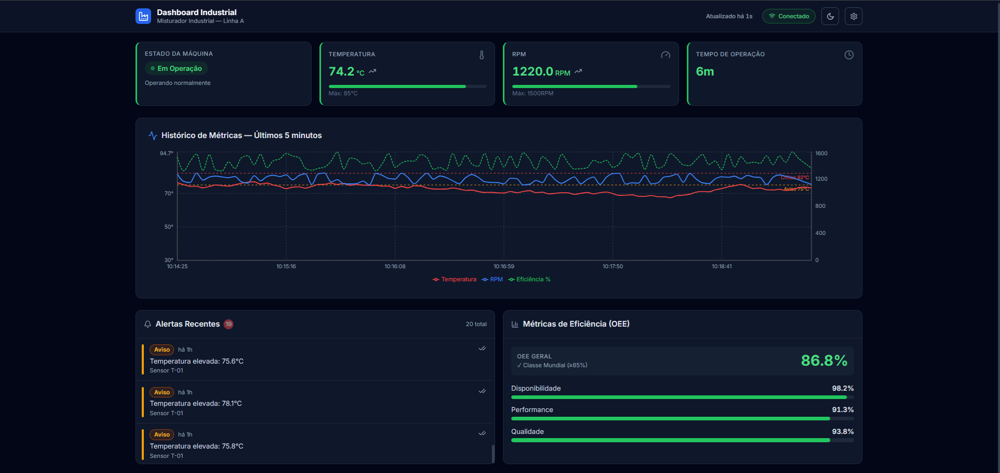
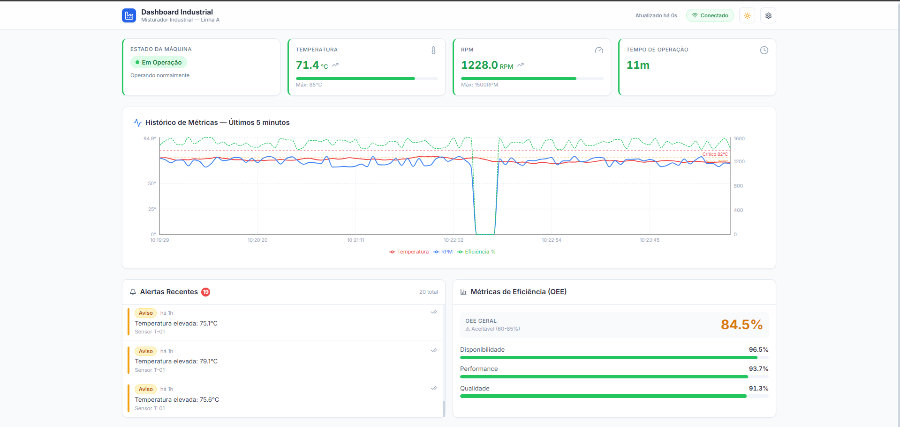
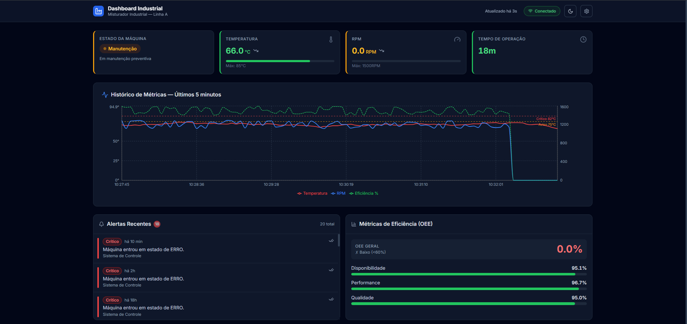
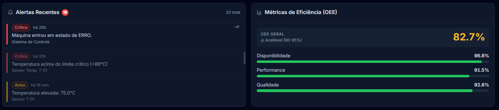
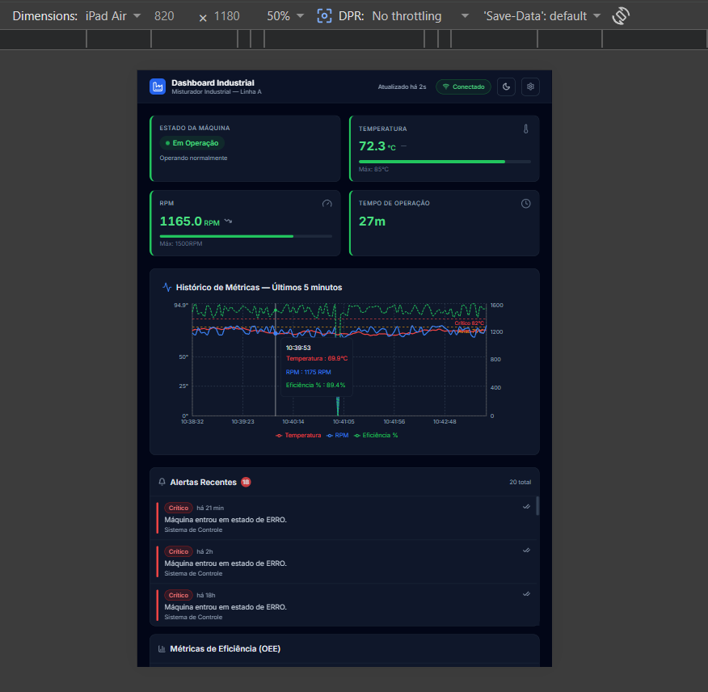
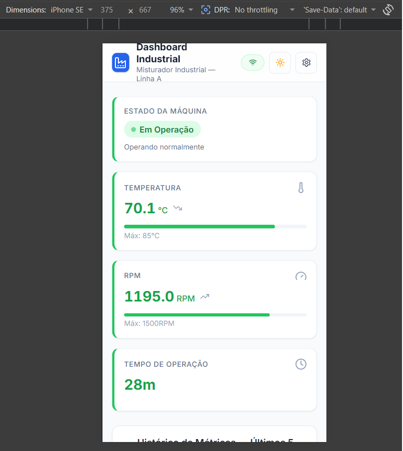

# 🏭 Dashboard de Monitoramento Industrial — Misturador

[](https://github.com/Eduardo-Magalhaes-hub/industrial-dashboard/actions/workflows/ci.yml)

Dashboard em tempo real para monitoramento de um misturador industrial, desenvolvido como solução para o desafio técnico de automação industrial.

---

## 📸 Screenshots

### Dashboard principal (modo escuro)



### Modo claro



### Estado de manutenção

Quando o simulador coloca a máquina em manutenção, o sistema reage corretamente: estado muda para "Manutenção" (cor âmbar), RPM cai para zero, a temperatura começa a esfriar e o OEE vai a zero porque não há produção.



### Painéis de alertas e OEE



### Responsividade

A interface se adapta a diferentes tamanhos de tela:

**Tablet (iPad Air, 2 colunas):**



**Mobile (iPhone SE, 1 coluna):**



---

## 🎯 Visão Geral

O sistema exibe em tempo real:

- **Estado operacional** da máquina (Em Operação / Parada / Manutenção / Erro)
- **Métricas físicas**: Temperatura (°C), RPM e Tempo de Operação, com **indicadores de tendência** (↗ ↘ —)
- **Gráfico histórico** com linhas de temperatura, RPM e eficiência, e linhas de referência para limites de aviso e crítico
- **Sistema de alertas** com níveis INFO / WARNING / CRITICAL, ordenação por severidade, reconhecimento individual e **deduplicação automática** (janela de supressão de 5 minutos)
- **OEE** (Overall Equipment Effectiveness) com Disponibilidade, Performance e Qualidade calculados conforme padrão ISO 22400
- **Dark/Light mode** persistido via localStorage, com script anti-FOUC para evitar flash de tema errado
- **Indicador de última atualização** com aviso visual quando os dados ficam obsoletos (>15 segundos)
- **Feedback sonoro** para alertas críticos novos (rastreamento por ID, não por contagem)

---

## 🗂️ Estrutura do Projeto (Monorepo)
````
industrial-dashboard/
├── apps/
│   ├── web/                # Frontend Next.js 14 + React 18 + Tailwind CSS
│   │   ├── src/app/        # App Router (layout + página)
│   │   ├── src/components/ # Componentes do dashboard, charts e UI
│   │   ├── src/hooks/      # useMachineStatus, useAlerts, useMetricHistory, useTheme
│   │   ├── src/lib/        # Utilitários (formatters, cn)
│   │   └── src/tests/  # Testes Jest + React Testing Library
│   └── api/                # Backend Express + node:sqlite (nativo do Node 22+)
│       └── src/
│           ├── routes/     # status, alerts
│           ├── services/   # simulator (com deduplicação de alertas)
│           ├── database/   # schema, seed
│           └── middleware/ # errorHandler
├── packages/
│   └── types/              # Tipos TypeScript compartilhados + DEFAULT_THRESHOLDS
├── .github/workflows/      # CI (type-check + lint + test)
├── docs/                   # Screenshots
├── turbo.json              # Orquestração do monorepo
└── pnpm-workspace.yaml
````

### Por que esse stack

- **Turborepo** — orquestração eficiente de builds/dev em monorepo, com cache inteligente
- **Next.js 14** (App Router) — SSR/CSR híbrido, routing nativo, ótimo DX
- **node:sqlite** — driver SQLite nativo do Node.js 22+. Não requer compilação de C++ nem instalação de binários, simplifica o setup e elimina problemas de build cross-platform
- **Recharts** — biblioteca de gráficos declarativa, integração natural com React, responsiva via `ResponsiveContainer`
- **pnpm workspaces** — instalação compartilhada de dependências, mais rápido que npm/yarn

---

## 🚀 Como Executar

### Pré-requisitos

- **Node.js ≥ 22** (necessário para `node:sqlite`)
- **pnpm 9.15.0** ou superior

```bash
# Instalar pnpm globalmente (se necessário)
npm install -g pnpm
```

### 1. Instalar dependências

```bash
# Na raiz do projeto
pnpm install
```

### 2. Popular o banco de dados com histórico inicial

```bash
pnpm --filter @industrial/api seed
```

Isso cria o arquivo `apps/api/industrial.db` com ~1440 pontos históricos (2h de operação simulada) e alertas iniciais.

> **Atenção:** rode o seed com o backend desligado. SQLite não compartilha bem o arquivo entre o seed e o simulador rodando.

### 3. Iniciar em modo desenvolvimento

```bash
# Inicia API (porta 3001) e Web (porta 3000) simultaneamente
pnpm dev
```

Acesse: **<http://localhost:3000>**

### 4. Executar testes

```bash
pnpm test
```

Resultado esperado: **25 testes** distribuídos em 4 suítes (formatters, MetricCard, OEEPanel, thresholds).

### 5. Verificar tipos

```bash
pnpm type-check
```

---

## 🔌 Endpoints da API

| Método | Rota                            | Descrição                |
| ------ | ------------------------------- | ------------------------ |
| GET    | `/api/health`                   | Health check do servidor |
| GET    | `/api/status/latest`            | Estado atual da máquina  |
| GET    | `/api/status/history?limit=100` | Histórico de métricas    |
| GET    | `/api/alerts?limit=20`          | Lista de alertas (ordenados por severidade) |
| PATCH  | `/api/alerts/:id/acknowledge`   | Reconhecer alerta        |
| POST   | `/api/alerts`                   | Criar alerta (uso interno) |

---

## ⚙️ Decisões Técnicas

### Simulação em tempo real

O backend usa **polling**: o frontend consulta a API a cada **3 segundos** para o status e a cada **5 segundos** para alertas e histórico. Essa abordagem foi preferida a WebSocket por ser:

- Mais simples de implementar, depurar e escalar horizontalmente
- Suficiente para o caso de uso (granularidade de segundos, não milissegundos)
- Compatível com qualquer infraestrutura HTTP (proxies, CDNs, load balancers)

O simulador (`apps/api/src/services/simulator.ts`) gera variações físicas realistas:

- Temperatura tende a 72°C com ruído gaussiano em operação, e a 50°C quando parada
- RPM varia em torno de 1200 com desvio de ±90
- Transições de estado (RUNNING → ERROR → MAINTENANCE → RUNNING) são probabilísticas

### Limites operacionais centralizados

A constante `DEFAULT_THRESHOLDS` em `@industrial/types` é a **fonte única de verdade** dos limites do misturador. Cards, gráfico e simulador consomem dela:

```typescript
DEFAULT_THRESHOLDS.temperature  // { warning: 75, critical: 82, max: 85 }
DEFAULT_THRESHOLDS.rpm          // { min: 900, nominal: 1200, max: 1500 }
DEFAULT_THRESHOLDS.efficiency   // { warning: 80, critical: 60 }
```

Alterar um limite aqui propaga para toda a aplicação sem deixar números soltos no código. Os valores respeitam o spec do desafio (temperatura máxima = 85°C) e a coerência matemática (warning < critical < max).

### Deduplicação de alertas

Em monitoramento real, condições persistentes (ex: temperatura alta por 5 minutos) gerariam um alerta por tick (a cada 3s), poluindo a lista. O simulador implementa **janela de supressão de 5 minutos**: antes de criar um alerta, consulta o banco e ignora se já existe um do mesmo componente + nível dentro da janela. Padrão usado em sistemas como PagerDuty e Grafana.

### Tema dark/light sem flash

Um script inline no `<head>` do layout lê o `localStorage` e aplica a classe `dark` no `<html>` **antes** do React montar, evitando flash de tema errado (FOUC). O hook `useTheme` usa estratégia determinística no SSR (sempre retorna `"light"` como fallback) e sincroniza com o DOM real apenas após `useEffect`, evitando erros de hidration do React.

### Indicador de tendência

Cada `MetricCard` numérico mostra ↗ ↘ — comparando o valor atual com a leitura anterior (via `useRef`). Há margem de 0.5% para evitar que o ícone fique alternando por flutuações irrelevantes do simulador.

### OEE (Overall Equipment Effectiveness)

Padrão ISO 22400 para medir produtividade industrial:

- **OEE = Disponibilidade × Performance × Qualidade**
- OEE ≥ 85% = Classe Mundial
- OEE 60–85% = Aceitável
- OEE < 60% = Baixo

---

## 🧪 Estratégia de Testes

- **Unitários** (`jest` + `@testing-library/react`): componentes de UI e funções utilitárias
- **Foco**: comportamento visível pelo usuário, não detalhes de implementação
- **25 testes** cobrindo:
  - Formatadores de tempo e número (incluindo `formatRelativeTime` com `jest.useFakeTimers()` para determinismo)
  - Renderização do `MetricCard` em diferentes estados (loading, normal, warning, critical, invertThreshold)
  - Painel de OEE em diferentes faixas
  - **Invariantes do domínio**: a constante `DEFAULT_THRESHOLDS` é testada por regras (warning < critical < max, conformidade com o spec de 85°C, valores fisicamente válidos)

---

## 🔄 Integração Contínua

Workflow do GitHub Actions roda em cada push e PR:

- `pnpm install --frozen-lockfile`
- `pnpm type-check`
- `pnpm lint` (não-bloqueante)
- `pnpm test`

Status atual: 

---

## 📦 Scripts Disponíveis

```bash
pnpm dev          # Desenvolvimento (web + api)
pnpm build        # Build de produção
pnpm test         # Testes (25 testes em 4 suítes)
pnpm lint         # Linting
pnpm type-check   # Verificação TypeScript

# Comandos por workspace:
pnpm --filter @industrial/api seed        # Popular banco de dados
pnpm --filter @industrial/api dev         # Só o backend
pnpm --filter @industrial/web dev         # Só o frontend
pnpm --filter @industrial/web test:watch  # Testes em modo watch
```

---

## 👤 Autor

Desenvolvido por **Eduardo Magalhães** como solução para o Desafio Técnico de Dashboard de Automação Industrial.

[GitHub](https://github.com/Eduardo-Magalhaes-hub) · [Repositório do projeto](https://github.com/Eduardo-Magalhaes-hub/industrial-dashboard)